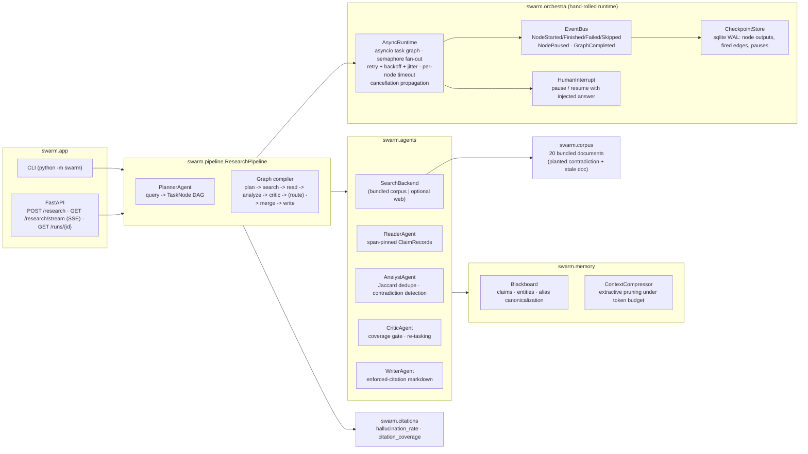
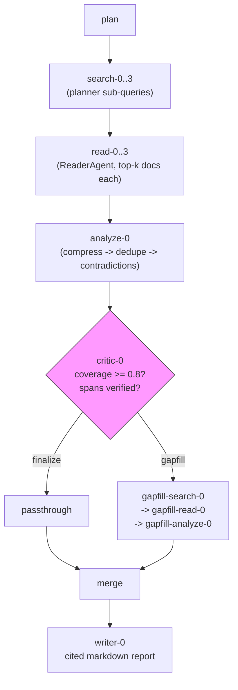

# SwarmResearch

**A multiagent deep-research assistant running on a hand-rolled async orchestration runtime — no LangGraph, no LangChain, no CrewAI.**

SwarmResearch takes a research question and turns it into a dynamically-planned task DAG: a planner decomposes the question into sub-queries, search nodes retrieve documents, reader nodes extract provenance-pinned claims, an analyst merges and cross-checks them, a critic gates coverage and triggers targeted re-tasking, and a writer composes a fully-cited markdown report. Every stage runs on **Orchestra**, a from-scratch asyncio task-graph runtime with typed channels, conditional edges, per-node retry/timeout, crash-resumable checkpointing, human-in-the-loop pauses, a typed event bus, and OpenTelemetry-style span emission.

The whole system runs **fully offline** against a bundled 20-document corpus with a planted contradiction pair and a stale document — the test suite (73 tests) never touches the network.

```bash
swarm research "What is the noise level of the XK-7 compressor module?" --offline --stream
```

## 🟢 New to AI? Read this first

**The problem, in human terms.** Ask a chatbot a hard research question and it answers in one breath — confidently, sometimes making things up, with no way to check. Asking real researchers, they'd split the question, read many documents, quote their sources, notice when two documents disagree, and check each other's work.

**What this project does.** SwarmResearch is that research team, automated:

- A **planner** splits your question into sub-tasks (like a manager writing a work plan).
- **Searchers** find documents; **readers** extract claims *with receipts* — an exact quote plus the document name and character position, so every fact can be traced back.
- An **analyst** merges claims across documents and flags when two sources contradict each other (the bundled corpus plants two documents claiming different noise levels — 42 vs 47 dB(A) — and the report surfaces it).
- A **critic** verifies each claim really appears at the cited location and orders re-searches when coverage is thin.
- A **writer** produces the final report where every factual sentence carries a [number] citation — the test suite proves **zero uncited factual sentences** and a **hallucination rate of exactly 0.0** on the offline corpus.

**The engineering feat underneath.** The team runs on a task-coordination engine built **from scratch** (the big frameworks were deliberately not used — the README contains an honest comparison table). Its party tricks, all proven by tests: if the process **crashes halfway**, restarting resumes from the last completed step without redoing finished work; long tasks **pause for human approval**; parallel work is capped so it never floods the sources; and every step streams live to the UI.

**Measured outcomes:** 73 automated tests pass offline in ~1.6s over a bundled 20-document corpus — covering correct task ordering, crash-resume without recomputation (proven with execution counters), the planted contradiction surfacing in the final report, and a fully-cited report with zero hallucinations.


```text
# Research report: What is the noise level of the XK-7 compressor module?
## Executive summary
- The review retained 35 verified claims across 5 themes with 1 flagged contradiction(s) [2] [1].
...
## Conflicting evidence
- numeric mismatch on XK-7 compressor module noise: source doc-02 states "47 dB(A)" [5]
  while source doc-03 states "42 dB(A)" [6].
```

---

## Why a custom runtime?

Frameworks optimize for time-to-first-demo. For a deep-research system, the runtime *is* the product: you need checkpointed, resumable, observable, budget-capped executions with human approval gates, and you need to own the failure semantics. Building it from scratch (~600 LOC for the entire orchestration layer) buys full control at a size where the cost is visible and auditable:

| | **SwarmResearch (Orchestra)** | **LangGraph** | **LangChain / LCEL** | **CrewAI** |
|---|---|---|---|---|
| Execution model | Explicit DAG, typed channels, async-native | Pregel-style super-steps | Chain/graph DSL | Role-based conversational loop |
| Checkpointing | SQLite per-node outputs + fired edges; resume skips completed nodes exactly | Pluggable state snapshots | Limited / manual | Memory-based, not durable |
| Conditional edges | Router fn returns next-node ids; unrouted branches statically visible | Built-in | Optional conditional chains | Implicit via agent dialogue |
| Cycles | Rejected at build time (bounded loop unrolling instead) | Supported | Supported (error-prone) | Core mechanism |
| Human-in-the-loop | `HumanInterrupt` pauses run; state persisted; resume injects answer | Interrupts (higher-level) | Manual | Limited |
| Retry / timeout / concurrency caps | Per-node policy: exponential backoff + jitter, `wait_for` timeout, semaphore fan-out cap | Per-node config | Per-chain | Minimal |
| Observability | Typed event bus + ForensiQ-compatible span dicts, zero deps | Callbacks + LangSmith (vendor) | Callbacks | Logging hooks |
| Dependencies pulled in | **0** (stdlib + pydantic/httpx/fastapi) | Large transitive tree | Very large | Large |
| Lock-in | None — nodes are plain async functions | Graph/State schema | Chain abstractions | Agent/Task abstractions |

**The honest trade-off:** LangGraph gives you mature state channels, subgraphs, and a studio UI on day one. Orchestra gives you ~600 auditable lines, exact control over checkpoint granularity, and no framework upgrade treadmill. For a portfolio-grade or embedded-critical system the second is often the better trade; for a fast-moving product team with graph-heavy iterative workflows, the first probably is.

## Architecture



### Agent topology (one research run)



The critic's conditional edge is the interesting part: both branches exist in the *static* graph, the router picks one at runtime, and the unrouted branch settles into `skipped`. Cycle detection still validates the whole candidate edge set at build time.

## Design decisions

**Custom runtime vs LangGraph.** See the table above. The decisive factors here were checkpoint semantics (per-node output persistence with a *provable* no-recompute guarantee — there is a test whose execution counters prove finished nodes never re-execute on resume), zero framework lock-in, and being able to answer "what happens when a node times out mid-retry" by reading one function. Cost: no ecosystem, no visual debugger, and we own edge cases like "pause cancels in-flight siblings and rewinds them to pending."

**Planner-to-DAG vs flat agent loops.** A flat loop (agent decides next step each turn) is flexible but unbounded and unreproducible. Compiling the plan into a static DAG gives dependency-ordered parallelism (verified by an observer test), a hard budget surface, checkpointable unit boundaries, and deterministic replay. The price is a two-phase design: the planner must anticipate re-tasking, which is why the critic routes through a pre-compiled bounded gap-fill branch instead of mutating a live graph — dynamic mutation mid-run would reintroduce the cycle problem the static validation exists to prevent.

**Bounded loop unrolling vs cycles.** Instead of a `critic -> search` cycle, the gap-fill branch is a *finite, statically-validated* tail: `critic -> gapfill-search -> gapfill-read -> gapfill-analyze -> merge`. One refinement pass, no infinite loop risk, and `Graph.validate()` stays meaningful (a real cycle would still throw at build time).

**Extractive compression vs LLM summarization memory.** Working memory is pruned by scoring sentences (salience + recency) against a token budget rather than asking an LLM to summarize. Extraction is deterministic, cheap, auditable, and preserves the char-span provenance the citation system depends on — a summarized claim has no span. The cost is less fluency and no cross-document synthesis in memory; synthesis happens in the writer, which cites originals.

**Citation provenance as an invariant, not a feature.** Every claim carries `doc_id, char_start, char_end` with the invariant `doc_text[char_start:char_end] == quote`. The critic re-verifies it, `hallucination_rate = claims lacking valid provenance / total claims` measures it, and the writer enforces that every factual sentence carries `[n]` or an explicit `analyst-inference` marker (citations are attached *inside* terminal punctuation so sentence tokenisation keeps them bound). The offline suite asserts `hallucination_rate == 0.0` and `citation_coverage == 1.0` end-to-end.

**Offline-first LLM access.** All model access sits behind an `LLMClient` Protocol (`async complete` + `stream`). `OpenAICompatClient` speaks any OpenAI-compatible endpoint; `EchoMockClient` is deterministic and local. Offline, the planner/reader use structured heuristics, so the full pipeline — including the planted-contradiction detection — is testable without keys or network.

## Module map

```
src/swarm/
├── orchestra/            # the hand-rolled runtime (no framework deps)
│   ├── graph.py          #   Node/Graph spec, typed channels, static cycle detection
│   ├── runtime.py        #   AsyncRuntime: scheduling, retry/timeout, events, spans
│   ├── checkpoint.py     #   sqlite WAL checkpoint store (node outputs, fired edges)
│   └── human.py          #   HumanInterrupt, queue/file input sources
├── agents/
│   ├── planner.py        #   query -> TaskNode DAG (heuristic offline, LLM optional)
│   ├── search.py         #   SearchBackend protocol; bundled corpus TF-IDF; guarded web
│   ├── reader.py         #   clean -> sentence spans -> ClaimRecords
│   ├── analyst.py        #   numpy Jaccard dedupe; numeric/negation contradictions
│   ├── critic.py         #   coverage gate; span verification; RetaskPlan
│   └── writer.py         #   enforced-citation report builder
├── memory/
│   ├── blackboard.py     #   shared typed store; entity alias canonicalization
│   └── compress.py       #   extractive salience+recency pruning under token budget
├── citations/graph.py    #   CitationRegistry, hallucination_rate, citation_coverage
├── pipeline.py           #   plan -> compile -> run -> metrics (the integration point)
├── app.py                #   FastAPI (POST /research, SSE stream, GET /runs/{id}) + CLI
├── llm.py                #   LLMClient Protocol, OpenAICompatClient, EchoMockClient
├── schemas.py            #   shared pydantic contracts (claims, plans, decisions)
├── settings.py           #   pydantic-settings (SWARM_* env prefix)
└── corpus/               #   20 bundled markdown docs (Kaltwerk heat pumps)
```

## Quickstart

```bash
pip install -e .
swarm research "How reliable is the XK-7 compressor module?" --offline --stream

# or as an HTTP service
swarm serve --host 127.0.0.1 --port 8000
# then: curl -X POST localhost:8000/research -H 'content-type: application/json' \
#         -d '{"query": "How noisy is the XK-7?", "offline": true}'
# and:  curl -N "localhost:8000/research/stream?run_id=<id>"   # SSE
```

Python API:

```python
import asyncio
from swarm.pipeline import ResearchPipeline
from swarm.settings import SwarmSettings

result = asyncio.run(
    ResearchPipeline(SwarmSettings(offline=True)).run("What refrigerant does Kaltwerk use?")
)
print(result.report)
print(result.metrics["hallucination_rate"], result.metrics["contradictions"])
```

## Configuration reference (`SWARM_*` env or `.env`)

| Variable | Default | Meaning |
|---|---|---|
| `SWARM_OFFLINE` | `true` | Bundled corpus + extractive heuristics, zero network |
| `SWARM_LLM_BASE_URL` | `https://api.openai.com/v1` | OpenAI-compatible endpoint (live mode) |
| `SWARM_LLM_API_KEY` | — | Bearer key; live mode requires it |
| `SWARM_LLM_MODEL` | `gpt-4o-mini` | Model id for the LLM client |
| `SWARM_WEB_SEARCH_ENDPOINT` | — | Optional search endpoint; empty keeps bundled corpus |
| `SWARM_MAX_CONCURRENCY` | `4` | Global fan-out cap (runtime semaphore) |
| `SWARM_MAX_DOCS_PER_TASK` | `4` | Reader budget per search task |
| `SWARM_CLAIMS_PER_DOC` | `5` | Extractive claims kept per document |
| `SWARM_TOKEN_BUDGET` | `6000` | Working-memory budget for the compressor |
| `SWARM_COVERAGE_THRESHOLD` | `0.8` | Critic coverage gate for re-tasking |

## Testing

73 tests, fully offline, no network access anywhere in the suite:

```bash
python -m pytest -q     # 73 passed
python -m ruff check src tests
```

Highlights of what is *proven*, not just smoke-tested:

- **Dependency ordering** — an observer records node completion; the test asserts topological validity of the observed order.
- **Crash/resume without recomputation** — a node raises on its first execution; after resume, execution counters show finished nodes ran exactly once while the failed node ran once more.
- **Fan-out cap** — six concurrent leaves under `max_concurrency=2`; the observed peak concurrency never exceeds 2.
- **Planted contradiction** — doc-02 (47 dB(A)) vs doc-03 (42 dB(A)) is detected as a numeric-mismatch contradiction and surfaces in the final report's *Conflicting evidence* section.
- **Zero uncited factual sentences** — the report is regex-parsed sentence-by-sentence; every factual sentence carries `[n]` or an `analyst-inference` marker.
- **`hallucination_rate == 0.0`** — every claim's quote is verified against its recorded span in the source document.
- **Critic re-tasking** — a fixture with artificially low coverage routes execution into the gap-fill branch; the planted high-coverage fixture routes straight to writing.
- **Ordered SSE end-to-end** — the ASGI test asserts `node_finished(search-i)` precedes `node_started(read-i)`, tokens precede the report, and the report precedes `done`.

## Production notes

- **Budget caps.** Every search task carries `max_docs`; the reader caps claims per doc; the compressor enforces the global token budget and logs the compression ratio onto the blackboard. The runtime caps parallelism (`max_concurrency`) — a hard backstop against fan-out cost explosions when the planner over-decomposes.
- **Tool sandboxing.** `WebSearchBackend` refuses to construct without an explicitly configured endpoint (no silent fallback to network), and the offline flag gates every LLM call. A production deployment would add per-backend allow-lists, response size caps, and content-type checks before reader ingestion.
- **Checkpoint hygiene.** The sqlite store uses WAL mode; node outputs are persisted as JSON with pydantic revival on resume, so a crashed run on one process resumes in another without re-executing completed (and possibly expensive) LLM nodes.
- **Observability.** Every attempt emits a span dict (`span_id`, `parent_id`, `name`, `stage`, `duration_ms`, `status`, `attrs`) — the exact shape expected by a ForensiQ-style forensics pipeline, adaptable to OTel by renaming keys.

## Limitations

- The offline analyst is lexical: contradiction detection relies on entity/attribute vocabularies and numeric parsing, not semantic understanding. Paraphrased conflicts without shared keywords are missed.
- One bounded refinement pass; the critic cannot iterate to convergence (deliberately — see design decisions).
- The bundled corpus is synthetic; search is TF-IDF, not semantic, and retrieval quality bounds claim quality.
- The API starts one run per POST and holds run state in-process; a multi-worker deployment would move the run registry and checkpoint store to shared storage.
- Claim extraction assumes well-formed prose sentences; tables and code blocks are skipped by design.

## Roadmap

- Pluggable retrieval (vector index) behind the existing `SearchBackend` protocol.
- Streaming claim extraction (incremental blackboard updates mid-read).
- Multi-run citation graphs (cross-run claim reuse with provenance chains).
- OTel span export alongside the raw span sink.
- Priority scheduling and deadline budgets in `AsyncRuntime` (nodes declare cost classes).

## License

MIT — © 2026 Akshay John Xavier
